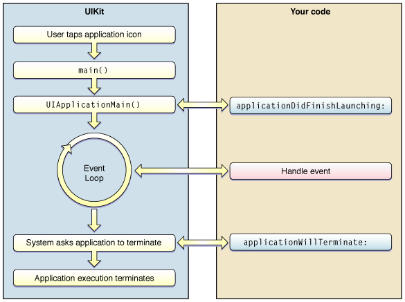

#### App LifeCycle은 어플을 사용하고 있는 화면에 올라와 있는 상태(foreground)거나 앱이 화면에 보이지 않는. 상태(Background)등 어플의 상태들에 관해 정의한 것이다.  

App LifeCycle을 설명하기 앞서 앱이 가질 수 있는 상태에 대해 설명하겠다.
## Execution States of Apps

app의 실행 status  

* Not Running 
   > App이 실행되지 않거나, App이 완전히 종료된 상태를 나타냄. 

* Inactive
> App이 실행중(foregfound)인 상태이지만 어떠한 event를 받지 않는 상태  

* Active
> App이 실행(foregfound) 상태에 있고, event를 받는다.
>> **Inactive와 Active 상태를 통합해 forground 상태라고 한다**. 

* Background
> foreground 상태에 있을때와는 다른 코드를 실행하고, 앱이 백그라운드에 있는 상태를 나타낸다. Background상태에 있는 앱은 Suspended 상태로 진입하기 전 잠깐 머무르는 상태이고, 추가적인 코드 실행이 필요하면 더 머무를 수 있다.  

* Suspended
> background 상태에서 추가적인 작업이 없다면 suspended 상태로 진입하게 됨. background상태와 같이 앱이 백그라운드에 있지만, 실행되는 코드가 없는 상태이다. iOS 운영체제는 메모리가 부족해지면 suspended 상태에 있는 앱들을 알림없이 종료시켜 메모리를 확보할 수 있다.

## App Life Cycle  

자 이제 App의 Life Cycle에 대해 알아보자.  

. 

1. App의 메인함수( main() ) 호출
2. 메인함수는 UIApplicationMain() 메소드를 호출하고 UIApplicationMain() 메소드는 UIApplication객체를 생성
3. UIApplication 객체는 info.plist 파일을 기반으로 필요한 데이터와 객체를 로드.
4.  AppDelegate객체를 생성, 앱 객체 (UIApplication) 와 연결하고 이벤트 루프 생성 등 실행을 준비, application(_:willFinishLaunchingWithOptions:)  메소드를 호출
5. 앱 실행 준비가 끝나면 UIApplication 객체는 AppDelegate 객체에게 application(_:didFinishLaunchingWithOptions:)를 호출하여 메세지를 보낸다. 
6. Main run loop를 실행. 
7. App을 더 이상 사용하지 않으면 iOS 운영체제에 applicationWillTerminate(_:)를 호출하여 메세지를 전달, 종료

### UIApplication  
> *앱 전체에 하나만 존재하는 객체이며, event loop에서 발생하는 여러 이벤트를 감지하고, Delegate에 전달하는 역할을 한다. app의 상태변화, 주요 event를 전달하여 custom code를 처리하도록 한다.*. 

### AppDelegate
> *UIApplication 객체로부터, 앱의 생명주기동안 event를 전달받아 custom code를 처리하는 기능을 위임받은 클래스이다. UIApplication를 상속받아 app의 초기화, 상태변화, event등을 관리한다.*
> *AppDelegate 클래스는 UIApplication 객체의 작업에 개발자가 접근할 수 있도록 하는 메소드들을 담고 있다.*  

### Delegate Call
> *App의 상태변화가 일어나면, AppDelegate 객체는 앱의 상태에 관련된 method들을 호출한다. App의 상태에 따라 사용자가 오버라이딩한 메소드를 실행시킬 수 있다.*

>> application(_:willFinishLaunchingWithOptions:)
- 앱이 최초로 실행될 때 호출되는 메소드.  초기화가 완료되기 직전에 호출되면 보통 최초로 실행할 코드를 작성한다.

>> application(_:didFinishLaunchingWithOptions:)
- 앱이 실행된 직후, 사용자에게 화면이 보여지기 직전에 호출되는 메소드. 앱 실행 후에 최종 초기화 코드를 작성한다.

>> applicationDidBecomeActive(_:)
- not running에서 foreground 상태로 진입할 때 , 즉 Active 상태로 전환된 직후에 호출된다.

>> applicationWillResignActive(_:)
- 앱이 Active에서 Inactive 상태로 전환되기 직전에 호출된다.

>> applicationDidEnterBackground(_:)
- 앱이 백그라운드 상태로 전환된 직후에 호출된다. 특별한 처리가 없다면 background에서 suspend 상태로 전환된다.

>> applicationWillEnterForeground(_:)
- 앱이 background에서 foreground로, 즉 화면에 보여지는 Active 상태가 되기 직전에 호출됨.  

>>applicationWillTerminate(_:)
- 앱이 종료되기 직전에 호출된다.

참고 링크

%EC%99%80%20%EC%95%B1%EC%9D%98%20%EA%B5%AC%EC%A1%B0(App%20Structure)/)

    
