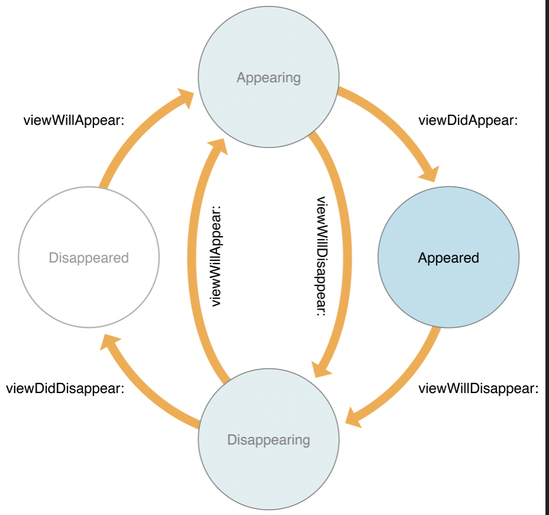

아이폰에서 어플리케이션을 사용할 때 기기의 한 화면 안에 여러가지 화면을 왔다갔다 하는데 이번 3주차 과제에는 그와 관련된 ViewController의 생명주기에 관해 알아보겠다.

## **ViewController LifeCycle 이란?**

#### 아이폰에서 어플리케이션을 사용하다보면 화면을 띄우고, 홈버튼을 눌러 화면을 없애고, 또는 네비게이션 버튼이나 탭 버튼 (이외에 다양한 객체들)을 눌러 화면 전환을 하게되는데, 이러한 모든 과정들은 UIViewController의 특정 상황에 관련된 메소드들로 관리하게 된다. 따라서 어떤 이벤트에 화면전환이 될때 어떤 (UIViewController에 정의된) 메소드들을 오버라이드 하여 적절한 행동을 추가하는지 알아야 한다.  


iOS 운영체제는 자동으로 이러한 컨트롤러가 상태간에 전환될 때 메소드들을 적절하게 불러온다.  

**UIViewController의 생명주기(상태)**

- View Controller의 생명주기. 

UIViewController 생명주기의 상태엔 총 8가지가 있지만 먼저 중요 5개 상태 먼저 살펴보자.

### * viewDidLoad() 
> 컨트롤러의 콘텐츠 뷰(해당 뷰의 가장 상위 계층 뷰)가 스토리보드로 부터 load되고 생성되고 나서 (모두 완료되고 난 후에 )호출된다. 이 메소드가 호출되는 시점에는 이미 outlet들이 모두 메모리에 적제되어 있는 상태이다. **해당 메소드는 content view가 처음 생성될 때 오직 한 번만 호출된다.** 그러므로 초기에 한번만 실행해줘야 할 코드들이 있다면 해당 메소드에 추가해주는 것이 좋다. 보통 화면이 로드되기 전 백그라운드에서 처리해줘야 하는 작업들, 네트워크 호출 등이 있다.  

### * viewWillAppear()
> 뷰 컨트롤러의 컨텐츠 뷰가 어플의 뷰 계층에 추가되기 직전에 호출된다. 컨텐츠 뷰가 현재 화면에 보이기 전에 실행되어야 할 코드들이 있다면 해당 메소드에 추가해주면 된다.  
> **viewDidLoad() 와 다른점은, viewDidLoad()  메소드는 해당 컨텐츠 뷰가 나타나기 위한 초기 설정들을 실행시켜 주지만, viewWillAppear()는 초기화 작업이 아닌 다른 뷰로 갔다가 돌아오거나, 어플을 나갔다 다시 해당 뷰로 돌아올 때 필요한 작업들을 수행한다.**
>(메소드의 이름에도 불구하고) 이 메소드는 단지 어플의 뷰 계층에 컨텐츠 뷰를 추가하려 한다는것을 나타내기 때문에, 해당 컨텐츠 뷰가 보여지는것이 보장되지 않을 수 있다. 다른 뷰에 의해 가려지거나 숨겨질 수 있다.

### * viewDidAppear()
> 뷰 컨트롤러의 컨텐츠 뷰가 어플의 뷰 계층에 추가된 직후에 호출된다. **즉 뷰가 화면에 나타난 직후에 실행된다.** 뷰가 화면에 나타나자마자 실행해주어야 할 코드들(데이터를 가져오거나, 애니메이션 효과를 보여주는 등) 이 있다면 해당 메소드에 추가해주면 된다. 해당 메소드는 컨트롤러에게 컨텐츠 뷰가 나타났다는 것을 (뷰 계층에 컨텐츠 뷰가 완전히 추가됐다는 것) 알리기 위한 역할을 한다.

### * viewWillDisappear()
> 컨텐츠 뷰가 어플의 뷰 계층에서 사라지기 직전에 호출된다. **view가 제거되기 전에 호출되므로**, view가 화면에서 없어지기 전에 실행되어야 할 코드가 있다면 해당 메소드에 추가해주면 된다. 해당 메소드는 해당 뷰가 삭제되려고 하는것을 뷰 컨트롤러에게 통지한다.

### *viewDidDisappear
> 컨텐츠 뷰가 어플의 뷰 계층에서 사라지고 난 직후에 호출되는 메서드이다. 뷰가 뷰 계층에서 사라지고 나서 호출되므로, 이후에 더 추가적으로 실행해야 하는 코드가 있다면 해당 메소드에 추가 시켜주면 된다. 해당 메소드는 컨트롤러에게 컨텐츠 뷰가 삭제되었다는것을 통지한다.

