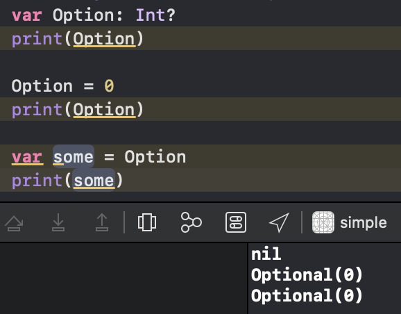
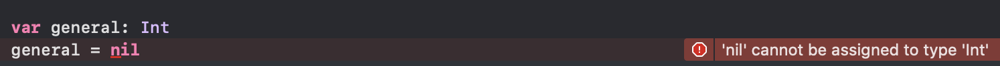
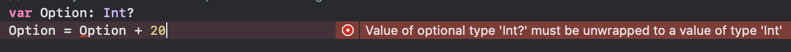
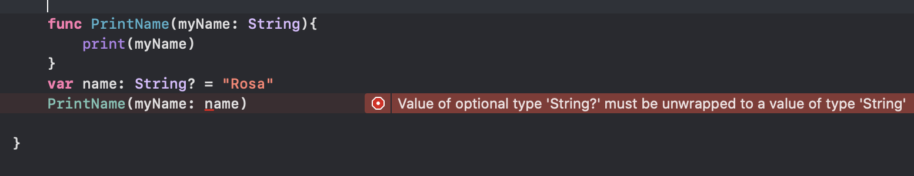
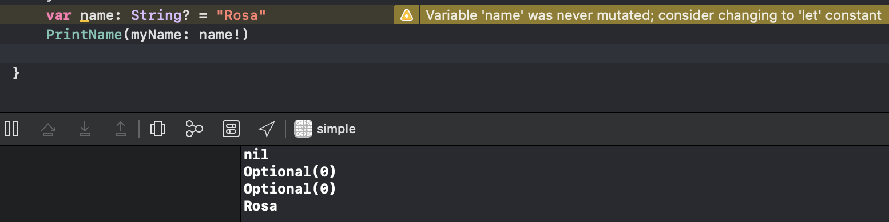
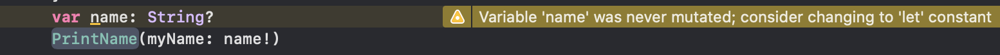
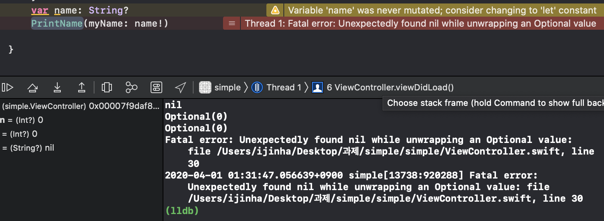

swift를 한달째 접하고 코드를 본격적으로 다루기 시작하면서 변수나 메소드에 "?"나,"!"가 붙어있는걸 발견할 수 있는데, 과제를 수행하면서 이 물음표와 느낌표가 적지않은 영향을 주었기 때문에 optional에 대해 자세하게 알아보겠다. 

## optional 이란?  
optional은 단어 뜻 그대로 '선택적이다' 라고 말할 수 있는데 이는 값에 대해 선택적이다 라고 할 수 있다.  
**값이 있을수도 있고(nill이 아님)**, **없을 수 도 있다(nill)** 는것을 나타내기 위해 optional 형식을 사용하는데, java나 C언어에서 같은 타 언어에서는 볼 수 없는 개념이기 때문에 기존에 타언어를 사용해왔던 사람들에겐 조금 생소하게 느껴질 수 있다.  
  
0과 nill의 차이

**그러면 왜 optional을 사용하는 것일까?**

내가 정리한 바로는
1. 타 언어에서는 nill(null)값을 체크할 때, 직접 null인지 아닌지 체크하는 과정을 거치는데 swift에서는 nill값을 optional 값을 통해 컴파일 시에 체크함으로써 잠재적인 에러를 탐지한다. 이는 코드를 효율적으로 작성하고 시간을 절약할 수 있다.
2. 컴파일 시에 nill값 체크를 수행한다.
3. 개발자들이 코드를 통한 의사소통을 할 때, optional이 해당 변수나 메소드의 파라미터의 nill값 여부에 대한 판단을 추측할 수 있다.
>>예를들면  위 코드에서 보이는것 처럼, 첫번째 canOptional 메소드에는 nill값이 절대 들어가면 안되고, 반드시 Int값을 가지는 파라미터가 들어와야 하는 반면, 두번째 neverOptional 메소드에서는 nill값이 파라미터로 들어오는것을 허용한다.  

그러면 이제 optional의 타입인 ?, ! 에 대해 각각 알아보겠다.

# Optional - ?
변수에 값이 있을 수 있고, 없을 수도 있는걸 나타낼 때 사용한다. 즉 변수 선언을 할 때, 해당 변수에는 자료형이 일치하는 데이터가 들어갈 수 도 있고, nill값이 될 수 있다.  

위 코드처럼 ? Optional로 변수를 선언만 하고 초기화하지 않는다면 자동적으로 nill값이 들어가게 된다. 앞서 설명한것 처럼 optional타입인 변수는 nill이 될 수 있는데, optional이 아닌 일반 변수에 nill로 초기화하게 된다면   
. 
위와 같이 바로 에러가 나게 된다. 따라서 일반 optional이 아닌 변수는 nil값을 담지 못한다. 이것이 optional과 일반 변수의 가장 큰 차이라 말할 수 있겠다.  
optional 타입 ? 으로 변수를 선언하게 된다면, 해당 변수에는 알맞은 타입의 데이터가 들어갈 수 도 있지만 nil값이 될 수 있기 때문에 다른 변수와 같이 기존 변수처럼 연산이 불가하다. 
. 

# Optional - !

그렇다면 optional의 !는 언제 어떻게 쓰일까?  
! 는 강제추출(Force Unwrapping) 이라고도 불리는데,?와 달리 optional 변수에 값이 있든 없든 해당 변수를 강제 언래핑하여 값을 확인한다. 이때 변수가 nil이라면(값이 존재하지 않다면) 에러를 발생시킬 수 있다.
간단한 예시를 들어보자.

. 
위 코드와 같이 PrintName의 파라미터에는 optional이 아닌 String이 되어야 하는데 optional string을 넣어줬을때 에러가 뜬다. 해당 name 변수에는 String 데이터가 있을 수도 있고, nil일 수도 있기 떄문이다. 에러 구문 또한 **"Value of optional type 'String?' must be unwrapped to a value of type 'String'"** 라고 나와있다.

이때 name뒤에 !를 붙여주면
. 
위와 같이 에러도 뜨지 않고, 빌드까지 성공적으로 된 모습을 볼 수 있다. 그러면 이제 name을 선언만 해주고 초기화 하지말아보자, name은 값이 없는 상태이므로 nil일것이다. 

printName 메서드에 nil값이 들어가면 안되는데도 불구하고 에러가 뜨지 않는다. ?와 달리 nil의 가능성을 고려하지않고 강제로 언래핑할것이기 때문이다. 해당 코드를 실행시켜보면,

오류가 나게된다. nil값이 들어가지 말아야 할 곳에 강제로 언래핑 하고 보니 nil값이 들어있기 때문이다.
따라서 !를 사용하여 강제 언래핑하기 전에는, 항상 optional 값이 nil이 아니라는 것을 확실히 해야한다.

